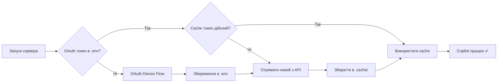

# 🔑 GitHub Copilot Token Guide

## Як працює авторизація

### 1. Перша авторизація
```bash
# Запустіть сервер
./restart_server.sh

# Зробіть запит до Copilot моделі (якщо токена немає)
# Автоматично запуститься OAuth Device Flow:
# ╔══════════════════════════════════════════════════════════════╗
# ║           🔐 GITHUB COPILOT AUTHENTICATION                   ║
# ╚══════════════════════════════════════════════════════════════╝
# 
# Please visit: https://github.com/login/device
# Enter code: XXXX-XXXX
```

1. Відкрийте https://github.com/login/device
2. Введіть код з консолі
3. Підтвердіть доступ
4. ✅ Токен автоматично збережеться в `.env`

---

## Де зберігаються токени

### OAuth токен (довгостроковий, ~1-2 роки)
- **Файл:** `.env`
- **Змінна:** `GITHUB_COPILOT_TOKEN=ghu_...`
- **Git:** ❌ НЕ в репозиторії (в `.gitignore`)
- **Використання:** Для отримання Copilot API токена

### Copilot API токен (короткостроковий, 25 хвилин)
- **Файл:** `.cache/githubcopilot-token.json`
- **Формат:** `tid=...;exp=...;sku=...`
- **Git:** ❌ НЕ в репозиторії (в `.gitignore`)
- **Використання:** Для запитів до Copilot API
- **Оновлення:** Автоматично кожні 25 хвилин

---

## Коли потрібна повторна авторизація

### ✅ Авторизація НЕ потрібна:
- 🔄 Перезагрузка VS Code
- 🔄 Перезапуск сервера (`./restart_server.sh`)
- 🔄 Перезагрузка системи (reboot)
- 🗑️ Видалення `.cache/` (токен оновиться автоматично)
- 📦 Git pull/push (токени не в репозиторії)

### ❌ Потрібна повторна авторизація:
- 🗑️ Видалено `.env` файл
- 💻 Клонування на новий комп'ютер
- ⏱️ OAuth токен застарів (через 1-2 роки)
- 🚫 Токен відкликано на GitHub

---

## Швидкі команди

### Перевірити токени
```bash
# OAuth токен
grep GITHUB_COPILOT_TOKEN .env | sed 's/=.*/=***EXISTS***/'

# Cache
ls -lh .cache/githubcopilot-token.json

# Термін дії cache
cat .cache/githubcopilot-token.json | grep expires_at
```

### Примусове оновлення
```bash
# Видалити тільки cache (OAuth токен залишиться)
rm -f .cache/githubcopilot-token.json

# Перезапустити сервер - автоматично оновить токен
./restart_server.sh
```

### Повна повторна авторизація
```bash
# Видалити всі токени
rm -f .cache/githubcopilot-token.json
sed -i '' 's/GITHUB_COPILOT_TOKEN=.*/GITHUB_COPILOT_TOKEN=your_copilot_token_here/' .env

# Перезапустити - запуститься OAuth flow
./restart_server.sh
```

---

## Тестування

```bash
# Перевірити чи працює Copilot
curl -X POST http://localhost:4000/v1/chat/completions \
  -H "Content-Type: application/json" \
  -d '{
    "model": "copilot-gpt-4o",
    "messages": [{"role": "user", "content": "Hi"}],
    "max_tokens": 20,
    "stream": false
  }'
```

---

## Troubleshooting

### 403 Forbidden
- ⏱️ Copilot API токен застарів
- 🔄 Перезапустіть сервер: `./restart_server.sh`
- ✅ Автоматично оновиться

### OAuth flow не запускається
- ❌ OAuth токен є, але недійсний
- 🗑️ Видаліть токен: `rm .cache/*.json`
- 🔄 Перезапустіть: `./restart_server.sh`

### Моделі не завантажуються
- ⏱️ Timeout при завантаженні (2 секунди)
- 🔄 Перезапустіть: `./restart_server.sh`
- ✅ Copilot моделі завантажаться після авторизації

---

## Безпека

- 🔒 `.env` файл **НЕ комітити** в Git
- 🔒 `.cache/` директорія **НЕ комітити** в Git
- ✅ OAuth токен довгостроковий, але в `.gitignore`
- ✅ Copilot API токен короткостроковий (25 хв), автооновлюється
- ✅ При втраті `.env` просто повторити авторизацію

---

## Структура

```
codespaces-models/
├── .env                              # OAuth токен (НЕ в Git)
│   └── GITHUB_COPILOT_TOKEN=ghu_...
├── .cache/                           # НЕ в Git
│   └── githubcopilot-token.json     # Copilot API токен (25 хв)
├── .gitignore                        # Захист токенів
│   ├── .env                          # ✅
│   └── .cache/                       # ✅
└── providers/
    └── githubcopilot.mjs             # OAuth + Token refresh
```

---

## Workflow



---

**💡 Порада:** Після клонування репо на новий комп'ютер, просто запустіть сервер і авторизуйтеся один раз. Токен збережеться і більше не потрібно буде авторизуватися (поки не видалите `.env`).
